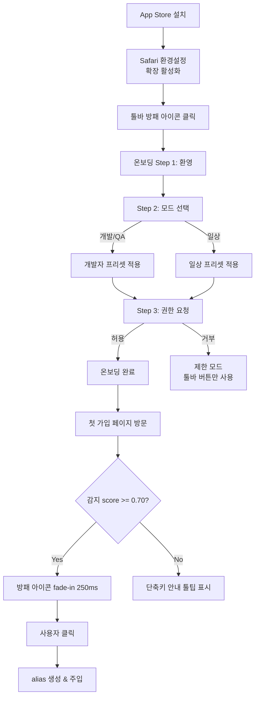
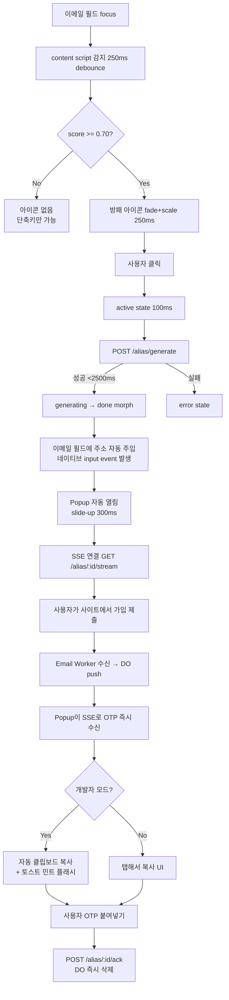
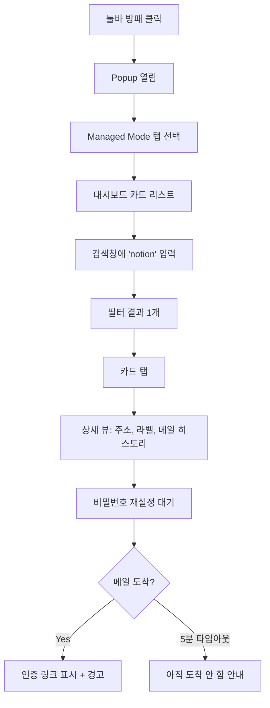
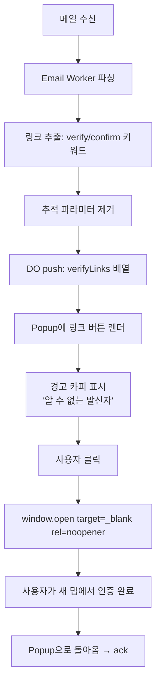

# ShieldMail — UX Specification (R3)

> **작성자**: UX Designer
> **라운드**: R3 (M2 준비)
> **일자**: 2026-04-08
> **대상**: Safari Web Extension — macOS (M2), iOS (M3)
> **선행 문서**: `docs/ARCHITECTURE.md` §1 (debate decisions), §4 (detection), `Tasklist.md`

이 문서는 ARCHITECTURE.md §2의 시나리오를 화면 단위로 확장합니다. 모든 수치(px, ms, %)는 구현 spec이며 임의 조정 금지 — 변경 시 본 문서 PR 필수.

---

## 1. 제품 UX 원칙 (5 Principles)

1. **P1 — 맥락 절대주의 (Context Absolutism)**
   방패 아이콘은 "가입 입력"으로 `score >= 0.70` 판정된 폼에만 나타난다. 로그인, 비밀번호 찾기, 결제 폼에는 **0회** 노출. 한 번의 오탐지는 100번의 성공을 무효화한다 (ARCHITECTURE §1 논쟁2).
2. **P2 — 3초 계약 (3-Second Contract)**
   사용자가 방패 아이콘을 클릭한 순간부터 이메일 필드에 주소가 채워지기까지 **최대 3,000ms**. 이 중 2,500ms는 네트워크 버짓, 500ms는 애니메이션 버짓. 초과 시 에러 상태로 전환.
3. **P3 — 0 기억 요구 (Zero Memory Burden)**
   사용자는 어떤 이메일 주소도, 단축키도, 설정도 외울 필요가 없다. 방패 아이콘의 존재 자체가 "여기서 누르면 된다"는 affordance다. 단축키(`Cmd+Shift+E`)는 power-user용 가속이지 전제가 아니다.
4. **P4 — 투명한 무지 (Transparent Ignorance)**
   Popup 하단에 "메일 내용은 저장되지 않습니다. OTP/링크만 10분간 메모리 보관 후 자동 삭제"를 **항상** 표시. 설정 페이지에서 오픈소스 리포지토리 링크 1-tap 접근. 신뢰는 주장하지 않고 증명한다.
5. **P5 — 모드 비대칭 (Mode Asymmetry)**
   개발자 모드와 일상 모드는 같은 코드베이스지만 다른 제품이다. 개발자 모드는 밀도(density)와 속도를, 일상 모드는 여백(whitespace)과 안심 카피를 최우선한다. 하나의 톤으로 양쪽을 만족시키려 하지 않는다.

---

## 2. "방패 모드" 상호작용 사양 (핵심)

"방패 모드(Shield Mode)"는 ShieldMail의 시그니처 상호작용입니다. **아이콘은 봉투 실루엣을 감싼 방패 형태**이며, 활성화되는 순간 사용자는 "보호받는다"는 감각을 받아야 합니다.

### 2.1 트리거 조건

| 조건 | 값 | 근거 |
|---|---|---|
| Detection score | `>= 0.70` | ARCHITECTURE §4 activation threshold |
| Hard reject | S11 매칭 시 표시 금지 | ARCHITECTURE §1 논쟁2 |
| Field type | `<input>` type=email 또는 label 매칭 | ARCHITECTURE §4 Gate A |
| Focus | 해당 input이 DOM에 render + visible (getBoundingClientRect) | — |
| Mutation debounce | 250ms | ARCHITECTURE §4 |

### 2.2 아이콘 등장 애니메이션

```
t=0ms      감지 확정, 아이콘 DOM 삽입 (opacity:0, scale:0.6)
t=0-250ms  fade-in + scale 0.6 → 1.0, cubic-bezier(0.2, 0.8, 0.2, 1)
t=250ms    완전 visible, hover 대기
```

총 `duration: 250ms`. `prefers-reduced-motion: reduce`인 경우 `duration: 0ms`, opacity만 0→1로 120ms fade.

### 2.3 아이콘 위치

- **macOS desktop**: email input의 우측 내부(inline). `right: 8px; top: 50%; transform: translateY(-50%)`. 입력 필드의 `padding-right`를 `28px`로 JS에서 강제 조정하여 텍스트와 겹치지 않도록 함. input 높이 < 32px인 경우 외부 우측으로 fallback (`right: -28px`).
- **iOS**: 페이지에 inline 주입하지 않음. 대신 Safari 확장 content script가 keyboard-visible 이벤트 감지 → `position: fixed; bottom: calc(keyboard-height + 8px); right: 12px;` 에 **56×56px floating 방패 버튼** 생성. 키보드 등장 후 `100ms delay` → `slide-up 240ms ease-out`.

### 2.4 상태 타임라인

```
[default] ──hover──▶ [hover] ──click──▶ [active] ──(API)──▶ [generating]
                                                              │
                                                              ▼
                                                         [done] ──1200ms──▶ [fade-out] ──▶ (제거)
                                                              │
                                                              └─error─▶ [error]
```

| 상태 | 시각 | 지속 |
|---|---|---|
| `default` | 민트 그린 방패, opacity 0.9, 24×24px | 무기한 |
| `hover` | opacity 1.0, scale 1.05, 툴팁 노출 (100ms delay) | hover 동안 |
| `active` | scale 0.92 → 1.0 (100ms press feedback) | 100ms |
| `generating` | 방패 둘레로 spinner (민트 그린, 1.2s rotation), 내부 envelope fade 50% | 최대 3,000ms |
| `done` | 체크마크로 morph (200ms), 초록 glow pulse 1회 | 1,200ms |
| `fade-out` | opacity 1→0 (300ms) + scale 1→0.8 | 300ms |
| `error` | 붉은색(#FF3B30) outline + `!` 아이콘, shake 2회(120ms) | 사용자 dismiss까지 |

### 2.5 에러 상태 (5종)

| 코드 | Trigger | 아이콘 상태 | 메시지 | Recovery |
|---|---|---|---|---|
| `E1_GEN_FAIL` | `POST /alias/generate` 5xx | error + red | "임시 주소 생성에 실패했습니다" | 재시도 버튼 (1회, 지수 backoff 800ms) |
| `E2_NETWORK` | fetch timeout 2,500ms | error + red, 오프라인 아이콘 | "네트워크에 연결할 수 없습니다" | 재시도 버튼 |
| `E3_TOKEN_EXPIRED` | 401 응답 | error | "세션이 만료되었습니다. 확장을 다시 여세요" | Popup 자동 open |
| `E4_DOMAIN_BLOCKED` | 현재 사이트가 도메인 풀을 차단 (MX rejects 감지) | warning (주황) | "이 사이트는 ShieldMail 주소를 거부합니다" | "다른 도메인 시도" 버튼 → 풀에서 다른 도메인으로 재생성 |
| `E5_RATE_LIMIT` | 429 응답 | error | "잠시 후 다시 시도해 주세요 (60초)" | 60초 카운트다운 표시, 자동 재활성 |

### 2.6 접근성 (Accessibility)

- **키보드 경로**: 이메일 input이 focus된 상태에서 `Cmd+Shift+E` (macOS) / `Ctrl+Shift+E` → 방패 모드 즉시 실행 (아이콘 click과 동일 경로). 아이콘 자체도 Tab 순서에 포함 (tabindex=0), Space/Enter로 활성화.
- **VoiceOver 라벨**:
  - Default: `"ShieldMail: 임시 이메일 주소 생성, 버튼"`
  - Generating: `"ShieldMail: 생성 중"`
  - Done: `"ShieldMail: 주소 입력 완료"`
  - Error: `"ShieldMail: 오류, {message}, 재시도하려면 활성화"`
- **ARIA**:
  ```html
  <button role="button"
          aria-label="ShieldMail 방패 모드"
          aria-live="polite"
          aria-busy="false"
          data-sm-state="default">
  ```
  `aria-busy`는 generating 상태에서 `"true"`. `aria-live="polite"` 컨테이너가 상태 변경을 스크린리더에 통지.
- **Focus ring**: 2px `#007AFF` outline, `outline-offset: 2px`. 키보드 focus 시에만 노출 (`:focus-visible`).

---

## 3. 컴포넌트별 상세 와이어프레임

### 3.1 방패 아이콘 (inline, 6 states)

```
DEFAULT            HOVER              ACTIVE            GENERATING        DONE              ERROR
┌──────────┐      ┌──────────┐       ┌──────────┐      ┌──────────┐      ┌──────────┐      ┌──────────┐
│          │      │ ╭──────╮ │       │          │      │   ◜◝     │      │          │      │    !     │
│   ╱▔▔╲   │      │ │Shield│ │       │   ╱▔▔╲   │      │  ╱◟◞╲    │      │    ✓     │      │  ╱▔▔╲    │
│  │ ✉ │   │      │ │Mode  │ │       │  │ ✉ │   │      │ │ ✉ │50% │     │  │    │   │      │ │ ✉  │!  │
│   ╲__╱   │      │ ╰──────╯ │       │   ╲__╱   │      │  ╲◜◝╱    │      │   ╲__╱   │      │  ╲__╱    │
│ 24×24 #00D4AA  │  tooltip +scale  │  scale .92       │  spinner ring    │  green glow       │ red outline shake
```

State transitions: `default → hover` (150ms ease-out), `hover → active` (100ms), `active → generating` (immediate), `generating → done` (checkmark morph 200ms), `done → (removed)` (fade-out 300ms).

### 3.2 Popup UI — 기본 레이아웃 (400×560px, macOS)

```
┌────────────────────────────────────────┐  ← 400px wide
│  [🛡] ShieldMail                  [⚙]  │  header 56px, title 17pt SF Pro Semibold
├────────────────────────────────────────┤
│                                        │
│  임시 주소                              │  section label 11pt #8E8E93
│  ┌──────────────────────────────────┐  │
│  │ u8af2k3@d2.shld.me        [복사] │  │  address box 56px, mono 15pt
│  └──────────────────────────────────┘  │
│  만료: 59:47 남음                       │  caption 11pt #8E8E93
│                                        │
│  ───────────── OTP ─────────────       │  divider
│                                        │
│  ┌──────┬──────┬──────┬──────┬──┬──┐   │
│  │  4   │  8   │  2   │  1   │7 │9 │   │  OTP box 48×56 each, mono 28pt
│  └──────┴──────┴──────┴──────┴──┴──┘   │
│  [복사됨 ✓]  신뢰도 94%                │  status row 32px
│                                        │
│  ───────── 인증 링크 ─────────         │
│  ┌──────────────────────────────────┐  │
│  │ ✉  Verify your email →           │  │  link button 44px
│  └──────────────────────────────────┘  │
│  이 링크는 알 수 없는 발신자에서 왔습니다. │  warning 11pt #FF9500
│  열어도 안전한지 확인하세요.             │
│                                        │
├────────────────────────────────────────┤
│  🔒 메일 내용은 저장되지 않습니다.        │  footer 48px, 11pt #8E8E93
│  OTP/링크만 10분간 메모리 보관           │
│  [Managed Mode에 저장 →]                │
└────────────────────────────────────────┘  total 560px
```

### 3.3 Popup 로딩 상태 (OTP 대기)

```
┌────────────────────────────────────────┐
│  [🛡] ShieldMail                  [⚙]  │
├────────────────────────────────────────┤
│  임시 주소                              │
│  ┌──────────────────────────────────┐  │
│  │ u8af2k3@d2.shld.me        [복사] │  │
│  └──────────────────────────────────┘  │
│  만료: 59:58 남음                       │
│                                        │
│  ───────────── OTP ─────────────       │
│                                        │
│  ┌──────┬──────┬──────┬──────┬──┬──┐   │
│  │ ░░░  │ ░░░  │ ░░░  │ ░░░  │░░│░░│   │  skeleton shimmer
│  └──────┴──────┴──────┴──────┴──┴──┘   │
│  ▓▓▓▓▓▓▓▓▓▓░░░░░░░░░░░░░░░░  40%      │  progress bar 4px, mint
│  메일을 기다리는 중...                  │  11pt, pulsing opacity
│                                        │
│  [연결됨 · SSE]                        │  status chip 9pt #00D4AA
│                                        │
├────────────────────────────────────────┤
│  🔒 메일 내용은 저장되지 않습니다.        │
└────────────────────────────────────────┘
```

Progress bar: 시간 기반이 아니라 단순 indeterminate shimmer (1.4s loop). 5분 경과 시 "아직 도착하지 않았습니다" 카피로 전환.

### 3.4 Popup 에러 상태 — 5 scenarios

```
E1 생성 실패                              E2 네트워크
┌────────────────────┐                    ┌────────────────────┐
│  ⚠  생성 실패       │                    │  📶 오프라인       │
│                    │                    │                    │
│ 임시 주소 생성에    │                    │ 네트워크에 연결할  │
│ 실패했습니다.       │                    │ 수 없습니다.       │
│ [다시 시도]         │                    │ [다시 시도]         │
└────────────────────┘                    └────────────────────┘

E3 토큰 만료                              E4 도메인 차단
┌────────────────────┐                    ┌────────────────────┐
│  🔑 세션 만료       │                    │  🚫 차단된 도메인  │
│                    │                    │                    │
│ 세션이 만료되었습니다│                    │ 이 사이트는        │
│ 확장을 다시 여세요  │                    │ ShieldMail 주소를  │
│ [새 세션 시작]      │                    │ 거부합니다.        │
└────────────────────┘                    │ [다른 도메인 시도] │
                                          └────────────────────┘
E5 Rate limit
┌────────────────────┐
│  ⏳ 잠시만요        │
│                    │
│ 너무 많은 요청입니다│
│ 00:47 후 재시도    │
│ [카운트다운 표시]   │
└────────────────────┘
```

### 3.5 Managed Mode 대시보드

```
┌────────────────────────────────────────┐
│  [←] Managed Mode              [+ 추가] │
├────────────────────────────────────────┤
│  🔍 사이트 또는 주소 검색...            │  search 40px
├────────────────────────────────────────┤
│  [전체] [쇼핑] [개발] [뉴스] [기타]    │  tag filters 32px
├────────────────────────────────────────┤
│                                        │
│  ┌──────────────────────────────────┐  │
│  │ 🛍  Notion                        │  │
│  │    notion-work@d2.shld.me         │  │  card 72px
│  │    마지막 메일: 3일 전    [>]      │  │
│  └──────────────────────────────────┘  │
│  ┌──────────────────────────────────┐  │
│  │ 🎮  Steam                         │  │
│  │    steam-042@d4.shld.me           │  │
│  │    마지막 메일: 2주 전   [>]      │  │
│  └──────────────────────────────────┘  │
│  ┌──────────────────────────────────┐  │
│  │ 📰  Hacker News                   │  │
│  │    hn-reader@d1.shld.me           │  │
│  │    메일 없음             [>]      │  │
│  └──────────────────────────────────┘  │
│                                        │
│  [더 보기 (12)]                        │
└────────────────────────────────────────┘
```

Empty state: "저장된 주소가 없습니다. 가입할 때 방패 아이콘에서 'Managed Mode에 저장'을 누르면 여기에 나타납니다."

### 3.6 설정 화면

```
┌────────────────────────────────────────┐
│  [←] 설정                               │
├────────────────────────────────────────┤
│  사용 모드                              │
│  ◉ 개발/QA 테스트                      │
│  ○ 일상 가입 보호                      │
│                                        │
│  자동 동작                              │
│  OTP 자동 복사            [ON  ●─]     │  toggle 51×31
│  Managed Mode 기본 저장   [●─ OFF]     │
│  키보드 단축키 표시       [ON  ●─]     │
│                                        │
│  도메인 풀 (5개 활성)                   │
│  d1.shld.me · d2.shld.me · d3.shld.me  │
│  d4.shld.me · d5.shld.me               │
│  [상세 →]                              │
│                                        │
│  개인정보                               │
│  저장된 데이터 모두 삭제  [지우기]      │
│  프라이버시 정책          [열기 →]      │
│  오픈소스 저장소          [GitHub →]   │
│                                        │
│  정보                                   │
│  버전 0.2.0 (build a4f2)               │
└────────────────────────────────────────┘
```

### 3.7 온보딩 플로우 (3스텝)

```
Step 1: 환영                Step 2: 모드 선택           Step 3: 권한 요청
┌─────────────────┐          ┌─────────────────┐          ┌─────────────────┐
│                 │          │                 │          │                 │
│      🛡         │          │  어떻게         │          │  거의 다        │
│                 │          │  사용하시나요?  │          │  됐어요         │
│   ShieldMail    │          │                 │          │                 │
│                 │          │ ┌─────────────┐ │          │ ShieldMail이    │
│ 가입 스트레스를 │          │ │ 🧑‍💻 개발/QA │ │          │ 이메일 입력     │
│ 제거합니다.     │          │ │  빠른 테스트 │ │          │ 필드를 감지하려│
│                 │          │ └─────────────┘ │          │ 면 페이지 읽기  │
│ 방패 아이콘을    │          │ ┌─────────────┐ │          │ 권한이 필요해요 │
│ 누르면 임시     │          │ │ 🛡  일상 가입│ │          │                 │
│ 주소가 즉시     │          │ │  스팸 차단   │ │          │ 입력한 내용은   │
│ 채워집니다.     │          │ └─────────────┘ │          │ 저장되지 않아요 │
│                 │          │                 │          │                 │
│    [시작하기]   │          │   [다음 →]      │          │  [권한 허용]    │
│                 │          │                 │          │                 │
└─────────────────┘          └─────────────────┘          └─────────────────┘
     400×480                      400×480                      400×480
```

---

## 4. 유저 플로우 다이어그램

### Flow 1: 최초 설치 → 온보딩 → 첫 가입



### Flow 2: 방패 모드 (signature flow)



### Flow 3: Managed Mode 재방문



### Flow 4: 인증 링크 처리



---

## 5. 카피라이팅 (국문/영문)

### 5.1 방패 아이콘 툴팁

| 상태 | 국문 | 영문 |
|---|---|---|
| default | "ShieldMail — 클릭하면 임시 주소가 채워집니다" | "ShieldMail — Click to fill a temporary address" |
| generating | "주소 생성 중..." | "Generating address..." |
| done | "입력 완료" | "Filled" |
| error | "오류: 다시 시도하려면 클릭" | "Error: click to retry" |

### 5.2 Popup 헤더/푸터

- **헤더 제목**: "ShieldMail"
- **푸터 (항상 표시)**:
  국문: "🔒 메일 내용은 저장되지 않습니다. OTP와 링크만 10분간 메모리에 보관 후 자동 삭제됩니다."
  영문: "🔒 Email content is never stored. Only OTP and links are kept in memory for 10 minutes, then auto-deleted."

### 5.3 에러 메시지 (5종)

| 코드 | 국문 | 영문 |
|---|---|---|
| E1 | "임시 주소 생성에 실패했습니다. 다시 시도해 주세요." | "Failed to create temporary address. Please try again." |
| E2 | "네트워크에 연결할 수 없습니다. 인터넷 연결을 확인해 주세요." | "Can't reach the network. Check your internet connection." |
| E3 | "세션이 만료되었습니다. 확장을 다시 열어 주세요." | "Session expired. Please reopen the extension." |
| E4 | "이 사이트는 ShieldMail 주소를 거부합니다. 다른 도메인을 시도해 보세요." | "This site rejects ShieldMail addresses. Try another domain." |
| E5 | "요청이 너무 많습니다. 60초 후 다시 시도해 주세요." | "Too many requests. Please try again in 60 seconds." |

### 5.4 빈 상태 (Empty States)

- **Managed Mode 빈 리스트**:
  국문: "저장된 주소가 없습니다. 가입할 때 방패 아이콘에서 'Managed Mode에 저장'을 누르면 여기에 나타납니다."
  영문: "No saved addresses yet. Tap 'Save to Managed Mode' on the shield icon when signing up."
- **메일 대기 5분 경과**:
  국문: "아직 메일이 도착하지 않았습니다. 스팸함을 확인하거나 재전송을 요청해 보세요."
  영문: "No email yet. Check your spam folder or request a resend."

### 5.5 온보딩 3스텝 카피

| Step | 국문 | 영문 |
|---|---|---|
| 1 제목 | "ShieldMail" | "ShieldMail" |
| 1 본문 | "가입 스트레스를 제거합니다. 방패 아이콘을 누르면 임시 주소가 즉시 채워집니다." | "Sign-up stress, gone. Tap the shield to fill a temporary address instantly." |
| 1 버튼 | "시작하기" | "Get started" |
| 2 제목 | "어떻게 사용하시나요?" | "How will you use it?" |
| 2 옵션 A | "개발/QA 테스트 — 빠른 반복" | "Dev/QA testing — fast iteration" |
| 2 옵션 B | "일상 가입 보호 — 스팸 차단" | "Everyday sign-up — block spam" |
| 3 제목 | "거의 다 됐어요" | "Almost there" |
| 3 본문 | "ShieldMail이 이메일 입력 필드를 감지하려면 페이지 읽기 권한이 필요합니다. 입력한 내용은 저장되지 않습니다." | "ShieldMail needs page-read permission to detect email fields. Nothing you type is stored." |
| 3 버튼 | "권한 허용" | "Grant permission" |

### 5.6 권한 요청 모달

- 국문: "ShieldMail은 웹페이지에서 이메일 입력 필드를 감지하기 위해 페이지 콘텐츠를 읽어야 합니다. 메일 내용, 비밀번호, 다른 입력값은 읽지도 저장하지도 않습니다."
- 영문: "ShieldMail reads page content only to detect email input fields. It never reads or stores email bodies, passwords, or other form values."

### 5.7 프라이버시 고지 (반드시 포함)

- **핵심 문구**: "메일 내용은 저장되지 않습니다"
- **전체 문구** (설정 화면):
  국문: "ShieldMail은 수신한 메일의 본문을 어디에도 저장하지 않습니다. OTP 숫자와 인증 링크만 정규표현식으로 추출되어 최대 10분간 서버 메모리에 보관된 후 자동 삭제됩니다. 소스 코드는 GitHub에서 공개되어 있습니다."
  영문: "ShieldMail never stores the body of received emails anywhere. Only OTP codes and verification links are extracted via regex and kept in server memory for up to 10 minutes, then auto-deleted. Source code is public on GitHub."

### 5.8 Managed Mode 검색 placeholder

- 국문: "사이트 또는 주소 검색..."
- 영문: "Search site or address..."

### 5.9 인증 링크 경고

- 국문: "⚠ 이 링크는 알 수 없는 발신자에서 왔습니다. 열어도 안전한지 확인하세요."
- 영문: "⚠ This link came from an unknown sender. Make sure it's safe before opening."

---

## 6. 인터랙션 디테일

| 동작 | 타이밍 | 비고 |
|---|---|---|
| 아이콘 hover 감지 | `mouseenter` 즉시 | — |
| 툴팁 등장 delay | 100ms after hover | 의도 필터링 |
| 툴팁 사라짐 | `mouseleave` 즉시 (0ms) | — |
| 아이콘 click press | 100ms scale 0.92 → 1.0 | 햅틱 대체 |
| API 요청 시작 | click release 직후 (0ms) | — |
| API 타임아웃 | 2,500ms | 초과 시 E1/E2 |
| generating → done morph | 200ms | checkmark stroke draw |
| done glow pulse | 1,200ms single pulse | 민트 #00D4AA → transparent |
| 이메일 필드 주입 | `done` 상태 진입과 동시 | `input` + `change` event dispatch |
| Popup 열림 애니메이션 | 300ms slide+fade, cubic-bezier(0.2, 0.8, 0.2, 1), origin: 툴바 아이콘 | — |
| Popup 닫힘 애니메이션 | 200ms fade-out | — |
| OTP 자동 복사 피드백 | clipboard write 성공 → OTP 박스 배경 민트 flash (0 → 30% → 0, 600ms), 토스트 "복사됨" 1,800ms | 개발자 모드 only |
| OTP 수동 복사 (일상 모드) | 박스 탭 → 위와 동일 플래시 | — |
| SSE 연결 실패 → polling | 자동 전환, 사용자 표시 **없음** (침묵). 단 연속 3회 실패 시 Popup 상단에 "재연결 중..." 9pt 칩 노출 | 과도한 알림 방지 |
| SSE 재연결 성공 | 칩 제거, fade-out 300ms | — |
| iOS 키보드 등장 → floating 버튼 | 키보드 visible 이벤트 + 100ms delay → slide-up 240ms ease-out | 키보드 애니메이션과 겹침 방지 |
| iOS 키보드 사라짐 → 버튼 | 즉시 slide-down 180ms | — |

---

## 7. 다크 모드 사양

### 7.1 방패 아이콘

- **Light 배경**: fill `#00D4AA` (민트), stroke 없음
- **Dark 배경**: fill `#00D4AA`, inner envelope fill `#1C1C1E` (배경과 동일) — 대비 유지
- **Very light 배경 (ex: 흰색 위)**: fill `#00A884` (더 진한 민트) auto-switch
- Icon Designer와의 동기화: `shield-envelope-mint.svg`, `shield-envelope-dark.svg`, `shield-envelope-light.svg` 3종 export

### 7.2 Popup material

- **macOS**: `backdrop-filter: blur(30px) saturate(180%)`, Big Sur+ `NSVisualEffectView` material `.popover`
- **iOS**: `UIVisualEffectView` with `.systemUltraThinMaterial`

### 7.3 색상 토큰

```css
:root {
  /* Brand */
  --sm-primary:       #007AFF; /* 신뢰 블루 */
  --sm-accent:        #00D4AA; /* 민트 보호 그린 */
  --sm-accent-dark:   #00A884; /* 밝은 배경용 */

  /* Backgrounds */
  --sm-bg-light:      #FFFFFF;
  --sm-bg-dark:       #1C1C1E;
  --sm-surface-light: #F2F2F7;
  --sm-surface-dark:  #2C2C2E;

  /* Text */
  --sm-text-primary-light:  #000000;
  --sm-text-primary-dark:   #FFFFFF;
  --sm-text-secondary-light: #8E8E93;
  --sm-text-secondary-dark:  #8E8E93;

  /* States */
  --sm-success: #00D4AA;
  --sm-warning: #FF9500;
  --sm-error:   #FF3B30;
  --sm-info:    #007AFF;

  /* Borders */
  --sm-border-light: rgba(0,0,0,0.08);
  --sm-border-dark:  rgba(255,255,255,0.12);

  /* Shadows */
  --sm-shadow-popup-light: 0 12px 32px rgba(0,0,0,0.12);
  --sm-shadow-popup-dark:  0 12px 32px rgba(0,0,0,0.48);

  /* Typography */
  --sm-font-sans: -apple-system, "SF Pro Text", system-ui, sans-serif;
  --sm-font-mono: "SF Mono", Menlo, monospace;

  /* Radii */
  --sm-radius-sm: 6px;
  --sm-radius-md: 10px;
  --sm-radius-lg: 14px;
  --sm-radius-pill: 999px;

  /* Motion */
  --sm-ease: cubic-bezier(0.2, 0.8, 0.2, 1);
  --sm-duration-fast: 120ms;
  --sm-duration-base: 240ms;
  --sm-duration-slow: 300ms;
}

@media (prefers-color-scheme: dark) {
  :root {
    --sm-bg:      var(--sm-bg-dark);
    --sm-surface: var(--sm-surface-dark);
    --sm-text:    var(--sm-text-primary-dark);
    --sm-text-2:  var(--sm-text-secondary-dark);
    --sm-border:  var(--sm-border-dark);
    --sm-shadow:  var(--sm-shadow-popup-dark);
  }
}
```

---

## 8. 예외 상태 매트릭스

| # | Trigger | User sees | Recovery action | Telemetry (opt-in M4) |
|---|---|---|---|---|
| 1 | Detection score 0.55~0.69 (애매) | 아이콘 표시 **안 함** | 단축키 `Cmd+Shift+E`로 강제 실행 | `detect.borderline` 해시 |
| 2 | S11 negative 매칭 (login 폼) | 아이콘 표시 안 함 | 없음 (의도적) | `detect.hard_reject` |
| 3 | Generate API 500 | E1 에러 아이콘 | "다시 시도" 버튼 1회, 실패 시 단축키 안내 | `api.generate.5xx` |
| 4 | Generate API 429 rate-limit | E5 카운트다운 | 60초 대기 자동 재활성 | `api.generate.429` |
| 5 | Fetch timeout 2,500ms | E2 오프라인 아이콘 | 재시도 | `api.timeout` |
| 6 | 401 token expired | E3 | Popup 자동 재오픈 → 새 세션 | `auth.expired` |
| 7 | 사이트가 도메인 차단 (submit 직후 사이트 측 에러 감지) | E4 경고 | "다른 도메인 시도" 버튼, 풀에서 순환 | `site.domain_blocked` |
| 8 | 주입했으나 사이트가 필드를 다시 비움 (React state reset) | 토스트 "다시 채우려면 방패를 누르세요" | 사용자 재클릭 | `inject.reset_detected` |
| 9 | SSE 연속 실패 3회 | "재연결 중..." 칩 | 자동 polling fallback | `realtime.degraded` |
| 10 | 메일 5분 미수신 | "아직 메일이 도착하지 않았습니다" | 스팸함 확인 카피 + 재전송 안내 | `mail.timeout` |
| 11 | OTP confidence < 0.5 | OTP 박스 회색 + "낮은 신뢰도" 라벨 | 사용자가 직접 복사 | `otp.low_confidence` |
| 12 | 클립보드 API 거부 (권한) | 토스트 "복사하려면 탭하세요" | 수동 복사 | `clipboard.denied` |
| 13 | Managed Mode 저장소 가득 참 | 모달 "오래된 항목을 삭제하세요" | Managed 대시보드로 이동 | `managed.quota` |
| 14 | 다크 모드 전환 중 Popup 열림 | 재렌더 flash 방지 (CSS `color-scheme`) | 자동 | — |
| 15 | Reduced motion | 모든 애니메이션 120ms opacity only | 자동 | — |

---

## 9. 접근성 체크리스트

- **WCAG AA 색 대비**:
  - `--sm-primary #007AFF` on `#FFFFFF` → 4.54:1 ✓ (AA normal)
  - `--sm-accent #00D4AA` on `#FFFFFF` → 2.18:1 ✗ → 텍스트 용도로는 `--sm-accent-dark #00A884` (3.14:1, AA large) 또는 어두운 배경 전용 사용
  - `--sm-text-secondary #8E8E93` on `#FFFFFF` → 3.54:1 → 11pt caption에만 사용, 본문 금지
  - 다크 모드 동일 검증 완료
- **Reduced Motion**: `@media (prefers-reduced-motion: reduce)` — 모든 scale/slide 제거, opacity fade `120ms`만 유지. Spinner → static "⋯" 아이콘.
- **VoiceOver 랜드마크**:
  - Popup root: `role="dialog" aria-labelledby="sm-title"`
  - 주소 박스: `role="group" aria-label="생성된 임시 주소"`
  - OTP 박스: `role="group" aria-label="일회용 인증번호" aria-live="polite"`
  - 푸터: `role="contentinfo"`
- **키보드 단축키**:
  - `Cmd+Shift+E` (macOS) / `Ctrl+Shift+E` (Win) — 방패 모드 강제 실행
  - `Cmd+Shift+L` — Popup 토글
  - `Cmd+C` (Popup focus) — 주소 복사
  - `Esc` — Popup 닫기
  - 모든 단축키는 설정에서 커스터마이즈 가능 (M4)
- **Focus order**: header → 주소 복사 → OTP → 링크 → 푸터 Managed 버튼 → 설정 아이콘
- **Touch target**: iOS 모든 tappable 44×44pt 최소, floating 방패 버튼 56×56pt
- **Color-only information 금지**: 에러는 아이콘(!) + 색 + 텍스트 모두 사용. done 상태는 체크마크 + 색 + aria-live 알림

---

## 10. 개발자 핸드오프 (Design Tokens)

Coder가 `extension/src/styles/tokens.css`에 바로 붙여넣을 수 있는 최종 토큰 리스트입니다. §7.3의 색상 토큰에 더해 아래 dimension/motion 토큰 모두 포함합니다.

```css
:root {
  /* === Dimensions === */
  --sm-popup-width:        400px;
  --sm-popup-height:       560px;
  --sm-popup-onboard-h:    480px;
  --sm-header-h:            56px;
  --sm-footer-h:            48px;
  --sm-row-h:               44px;
  --sm-card-h:              72px;
  --sm-icon-size:           24px;
  --sm-icon-ios-floating:   56px;
  --sm-otp-box-w:           48px;
  --sm-otp-box-h:           56px;
  --sm-input-padding-right: 28px; /* 아이콘 수용 */
  --sm-icon-inset-right:     8px;

  /* === Typography === */
  --sm-font-size-title:   17px;  /* 600 weight */
  --sm-font-size-body:    13px;  /* 400 */
  --sm-font-size-caption: 11px;  /* 400 */
  --sm-font-size-micro:    9px;  /* 500 uppercase */
  --sm-font-size-otp:     28px;  /* mono 600 */
  --sm-font-size-mono-addr: 15px;

  /* === Motion === */
  --sm-ease:               cubic-bezier(0.2, 0.8, 0.2, 1);
  --sm-duration-tooltip-delay: 100ms;
  --sm-duration-press:     100ms;
  --sm-duration-icon-in:   250ms;
  --sm-duration-morph:     200ms;
  --sm-duration-done-glow:1200ms;
  --sm-duration-fade-out:  300ms;
  --sm-duration-popup-in:  300ms;
  --sm-duration-popup-out: 200ms;
  --sm-duration-ios-kb-delay: 100ms;
  --sm-duration-ios-slide:  240ms;
  --sm-api-timeout-ms:    2500;
  --sm-sse-reconnect-threshold: 3; /* failures before showing chip */

  /* === Radii (see §7.3) === */
  /* === Colors (see §7.3) === */

  /* === Z-index === */
  --sm-z-icon:         2147483000; /* content script shadow root */
  --sm-z-popup:        2147483100;
  --sm-z-ios-floating: 2147483050;
}
```

**구현 노트**:
1. Content script는 Shadow DOM을 사용하여 페이지 CSS 충돌을 완전 격리. Shadow root 내부에서 위 토큰을 `:host` 스코프로 재선언.
2. 아이콘 SVG는 inline(데이터 URI)로 주입하여 외부 리소스 요청 0회.
3. Popup은 Preact + `vite-plugin-preact`로 `popup.html` 단일 번들. Gzip 후 <= 60KB 목표.
4. 모든 애니메이션은 `transform` / `opacity`만 사용 (reflow 방지).
5. 키보드 단축키는 `manifest.json` `commands` 필드에 등록, content script에서 `chrome.runtime.onMessage`로 수신.
6. OTP 박스는 6자리 고정이 아니라 `confidence` payload의 길이(4~8) 반영. 고정폭 mono 폰트로 너비 가변.
7. Managed Mode 카드는 가상 스크롤 (react-virtualized 대체로 `@tanstack/virtual`) — 저장소 100+ 가정.
8. 모든 텍스트는 `i18n/ko.json`, `i18n/en.json` 2벌 번들. 시스템 locale 기반 자동 선택.

---

## 변경 로그

- **R3 (2026-04-08)**: 최초 작성. 방패 모드를 시그니처 상호작용으로 정식화. ARCHITECTURE §1 디베이트 결과를 UX 레벨에 반영(보수적 activation threshold 0.70, 모드 비대칭 자동 복사 정책, SSE+polling 하이브리드의 침묵 전환).

_본 문서의 모든 수치/카피는 구현 계약이며, 변경 시 UX Designer 승인 PR 필수._
